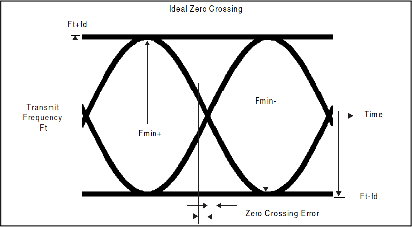

# Volume 6 Low Energy Controller

# 卷6 低功耗控制器

## 1 SCOPE

## 1 概述

Bluetooth Low Energy(LE) devices operate in the unlicensed 2.4GHz ISM(Industrial Scientific Medical) band. A frequency hopping transceiver is used to combat interference and fading.1

蓝牙低功耗(LE)设备工作在免许可的2.4GHz ISM频段。并使用跳频收发器对抗干扰和衰减。

Which 1:

1.The transceiver defined in this Part does not meet the requirements for 'frequency hopping' in some governmental regulations. See the Bluetooth Low Energy Regulatory Aspects White Paper for more information.

1、此部分定义的收发器不满足一些国家条例中“跳频”的要求。参考Bluetooth Low Energy Regulatory Aspects White Paper 以了解更多信息。

Two modulation schemes are defined. The mandatory modulation scheme ("1 Msym/s modulation") uses a shaped, binary FM to minimize transceiver complexity. The symbol rate is 1 Msym/s. An optional modulation scheme ("2 Msym/s modulation") is similar but uses a symbol rate o f 2 Msym/s.

标准定义了两种调制方案。强制支持的调制方案(“1 Msym/s调制”)使用二进制整形FM以最小化收发器复杂度。其符号率为1 Msym/s。可选的调制方案(“2 Msym/s 调制”)类似，但使用2 Msym/s符号率。

The 1 Msym/s modulation supports two PHYs:

+ LE 1M, with uncoded data at 1 Mb/s;
+ LE Coded, with the Access Address, Coding Indicator, and TERM1 coded at 125 kb/s and the payload coded at either 125 kb/s or 500 kb/s.

1 Msym/s 调制支持两种PHY:

+ LE 1M,数据率1 Msym/s无编码
+ LE 编码，Access Address, Coding indicator及TERM1编码速率为125 kb/s，而负载数据编码为500 kb/s.

A device shall support the LE 1M PHY. Support for the LE Code PHY is optional.

设备必须支持LE 1M PHY，可选支持LE Coded PHY。

The 2 Msym/s modulation supports a single PHY.

2 Msym/s调制只支持一种PHY.

A Time Division Duplex(TDD) scheme is used on all PHYs. The specification defines the requirements for a Bluetooth radio for the Low Energy radio.

所有PHY上都实现了时分双工机制。本规范定义了低功耗射频对蓝牙射频的要求。

Requirements are defined for two reasons:

+ Provide compatibility between radios used in the system
+ Define the quality of the system

定义相关要求有两个原因：

+ 为系统中使用的射频提供兼容性
+ 定义系统质量

An LE radio shall have a transmitter or a receiver, or both.

LE 射频需要支持发送机或接收机，或者都支持。

The LE radio shall fulfill the stated requirements for the operation conditions declared by the equipment manufacture (see Section A.1).

LE射频必须满足所述设备厂家声明的工作条件要求。

The specification is based on the established regulations for Europe, Japan, North America, Taiwan, South Korea and China. The standard documents listed below are only for information, and are subject to change or revision at any time.

本规范基于以下国家已建规则：欧洲，日本，北美，台湾，南韩和中国。以下列出的标准文档仅做参考，并随时可能更改或修订。

The Bluetooth SIG maintains regulatory content associated with Bluetooth technology in the 2.4GHz ISM band on its web site, at  https://www.blue-tooth.com/develop-with-bluetooth/build/regulatory-knowledge-database.

蓝牙SIG在其官网上管理2.4GHz ISM频段中蓝牙技术相关的调整后的内容，网址： https://www.blue-tooth.com/develop-with-bluetooth/build/regulatory-knowledge-database。

**Europe:**

Approval Standards: European Telecommunications Standards Institute, ETSI Documents: EN 300 328, EN 300 440, EN 301 489-17

**欧洲：**

审批标准：欧洲电信标准协会，ETSI 文档：EN 300 328, EN 300 440, EN 301 489-17

**Japan:**

Approval Standards: Japanese Radio Law, JRL

Documents: Japanese Radio Law: Article 4.3, Article 28, Article 29, Article 38

Radio Equipment Regulations: Article 5, Article 6, Article 7, Article 14, Article 24, Article 9.4, Article 49.20.1.C.2, Article 49.20.1.E.3

Radio Law Enforcement Regulations: Article 6.2, Article 6.4.4.1, Article 7

**日本：**

审批标准：日本无线电法律，JRL

文档：日本无线电法律：条例4.3，条例28，条例29，条例38

无线电设备条例：条例5，条例6，条例7，条例14，条例24，条例9.4，条例49.20.1.C.2，条例49.20.1.E.3

无线电法律强制条例：条例6.2，条例6.4.4.1，条例7

**North America:**

Approval Standards: Federal Communications Commission, FCC, USA Documents: CFR47, Part 15: Section 15.205 and 15.247

Approval Standards: Industry Canada, IC, Canada

Documents: RSS_210 and RSS 139

**北美：**

审批标准：联邦通信委员会， FCC，USA

文档：CRF47，Part 15：章节15.205，15.209和15.247

许可标准：加拿大工业部，IC，加拿大

文档：RSS-210和RSS139。

**Taiwan:**

Approval Standards: National Communications Commission, NCC

Documents: Low Power 0002 (LP0002); Low-power Radio-frequency Devices Technology Regulations

**台湾：**

审批标准： 国家通信委员会，NCC

文档：低功率0002 (LP0002); 低功率射频设备技术条例。

**South Korea:**

Approval Standards: Korea Communications Commission, KCC

Documents: Rules on Radio Equipment 2008-116

**南韩：**

审批标准：韩国通信委员会，KCC

文档：无线设备2008-16中的规则

**China:**

Approval Standards: Ministry of Industry and information Technology, MIIT

Documents: MIIT regulation [2002]353

**中国：**

审批标准：工信部，MIIT

文档：MIIT条例 [2002]353

# 2 FREQUENCEY BANDS AND CHANNEL ARRANGEMENT

# 2 频带及信道分配

The LE system operators in the 2.4GHz ISM band at 2400-2483.5 MHz. The LE system uses 40 RF channels. These RF channels have center frequencies 2402 + k * 2 MHz, where k = 0,...,39.

LE系统工作在2.4GHz ISM频带中，频率范围为2400-2483.5 MHz。LE系统使用40个射频信道。这些射频信道中心频率为 2402 + k * 2 MHz, 其中 k = 0,...,39。

| Regulatory Range | RF Channels                |
| ---------------- | -------------------------- |
| 2.400-2.4835GHz  | f=2402+k*2 MHz, k=0,...,39 |

Table 2.1: Operating frequency bands

# 3 TRANSMITTER CHARACTERISTICS

# 3 传输特性

The requirements stated in this section are given as power levels at the antenna connector of the LE device. If the device does not have a connector, a reference antenna with 0 dBi gain is assumed.

本章节所述的要求由LE设备天线连接吕处的功率电平给定。如果设备没有连接器，则假设为0dBi的参考天线。

Due to the difficulty in making accurate radiated measurements, systems with an integral antenna should  provide a temporary antenna connector during LE PHY qualification testing.

由于难于进行准确辐射测量，系统中的集成天线应该在LE PHY质量测试中提供临时的天线连接器。

For a transmitter, the output power level at the maximum power setting shall be within the limits defined in Table 3.1.

对发送机而言，电大输出功率电平配置必须在表3.1中定义的限值中。

| Minimum Output Power | Maximum Output Power |
| -------------------- | -------------------- |
| 0.01 mW (-20dBm)     | 100mW (+20 dBm)      |

Table3.1: Transmission power

表3.1: 发送功率

Devices shall not exceed the maximum allowed transmit power levels set by the regulatory bodies that have jurisdiction over the locales in which the device is to be sold or intended to operate. Implementers should be aware that the maximum transmit power level permitted under a given set of regulations might not be the same for all modulation modes.

设备不能超过其销售或运行所在地具有监管权的监管机构设定的最大允许发送功率。设备商需要注意法规给定的最大许可发送功率电平集在不同的调制模式下可能是不一样的。

Using high transmit power in use cases where short ranges could be encountered can cause the receiver on the remote device to be saturated and result in link failure. The LE Power Control Request feature can be used to adjust a connected remote device's transmit power level base on the receiver's signal level. When the LE Power Control Request feature is used on a  connection with long connection intervals, devices should use reliable RSSI measurements from recent connection events to determine whether or not to send power control requests. When a devices is capable of adjusting its transmit power level using the LE Power Control Request feature, the difference between any two adjacent transmit power levels supported by the radio design should be no greater than 8dB. When the LE Power Control Request feature is not supported by either the local or remote device, implementers should avoid use of high output power in such scenarios or employ a mechanism for switching between two or more transmit power levels in a attempt to establish, re-establish, or maintain connections.

在可能遇到的短距离的情况下使用高功率传输可能导致远端接收器设备饱合，以致于连接失败。LE Power Control Request特性可用于根据接收端接收到的信号电平调整远端已连接设备的发送功率电平。当LE Power Control Request特性用于长连接间隔的连接时，设备应该从当前连接事件中测量可靠的RSSI值来决定是否发送功率功率请求。当某个设备支持使用LE Power Control Request特性调整其发送功率时，射频端所支持的两个相邻发送功率电平差异应该不大于8dB. 如果当前设备与远端设备都不支持LE Power Control Request特性时，设备商应该避免在这种情况下使用高输出功率，或者在进行尝试连接，重连或维护连接时使用可在两种或多种传输功率间进行切换的机制。

The output power control of a device may be changed locally, for example to optimize the power consumption or reduce interference to other equipment.

设备的输出功率可能由其自己调整，比如为了优化功耗，或都减少对其它设备的干扰。

Bluetooth devices may be informatively classified into power classes base on the highest output power the LE PHY support, as defined in Table 3.2.

 蓝牙设备可以根据其LE PHY支持的最高输出功率分为不同功率等级，如表3.2所定义的。

| Power Class | Maximum Out Power(Pmax) | Minimum  Output Power1 |
| ----------- | ---------------------------------- | --------------------------------- |
| 1           | 100mW (+20dBm)                     | 10mW(+10dBm)                      |
| 1.5         | 10mW(+10dBm)                       | 0.01mW(-20dBm)                    |
| 2           | 2.5mW(+4dBm)                       | 0.01mW(-20dBm)                    |
| 3           | 1mW(0dBm)                          | 0.01mW(-20dBm)                    |

Table 3.2 LE PHY power classes

表3.2 LE PHY功率等级

1. Minimum output power at maximum power setting.

1. 最大功率设置下的最小输出功率。

## 3.1 MODULATION CHARACTERISTICS

## 3.1 调制特性

The modulation is Gaussian Frequency Shift Keying (GFSK) with a bandwidth-bit period product BT=0.5. The modulation index shall be between 0.45 and 0.55. A binary one shall be represented by a positive frequency deviation, and a binary zero shall be represented by a negative  frequency deviation.

设备模式为带宽位周期乘积BT=0.5的高斯频移键控(GFSK)。调制系数应在0.45-0.55之间。二进制1由正频率偏移表示，而二进制0由负频率偏移表示。

Figure 3.1 GFSK parameter definition.

图3.1 GFSK参数定义

For each transmission the minimum frequency deviation,

Fmin=min{|Fmin+, Fmin-}

which corresponds to a 1010 sequence, shall be no smaller than ±80% of the frequency deviation with respect to the transmit frequency, which corresponds to a 00001111sequence.

其中，对于1010序列，应该不小于相对发送频率的频率偏差的±80%，即对应于00001111序列。

The minimum frequency deviation shall never be less than 185kHz when transmission at 1 megasymbol per second (Msym/s) symbol rate and never be less than 370kHz when transmission at 2 Msym/s symbol rate. The symbol timing accuracy shall be better than ±50ppm.

当传输符号率为1Msym/s时，最小频率偏移不能小于185kHz，当传输符号率为2Msym/s时，不能小于370kHz。符号时序精度要求好于 ±50ppm。

The zero crossing error is the time difference between the ideal symbol period and the measured crossing time. This shall be less than  ±1/8 of a symbol period.

过零误差是理想符号周期与测试到的信号交叉时间之间的时间差。应该小于符号周期的 ±1/8。

See Figure 3.1 for the definitions of some symbols and terms in these requirements.

参考图3.1了解这些要求中符号和术语的定义。

### 3.1.1 Stable modulation index

### 3.1.1 稳定的调制系数

An LE device with a transmitter that has a stable modulation index may inform the receiving LE device of this fact through the feature support mechanism (see [Vol 6] Part B, Section 4.6). The modulation index for these transmitters shall be between 0.495 and 0.505. A device shall only state that it has a stable modulation index if that applies to all LE transmitter PHYs it supports.

具有稳定调制系数的LE发送机设备可能通过特性支持机制[参考卷6，B部分，4.6章节]将此事实通知到LE接收设备。这些发送机的调制系统必须在0.495到0.505之间。如果应用于所有支持的LE发送机PHY，设备应该强调其具有稳定的调制系数。

